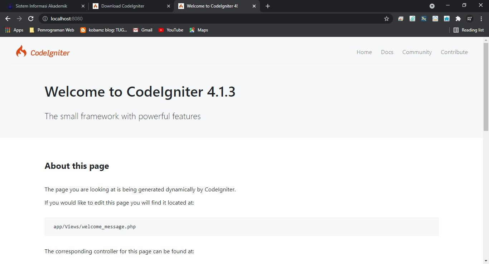
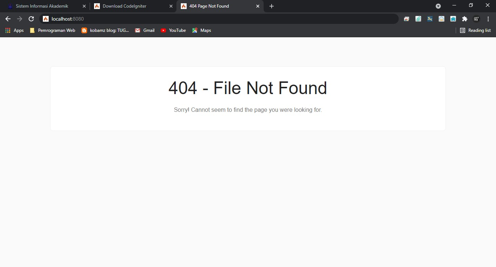
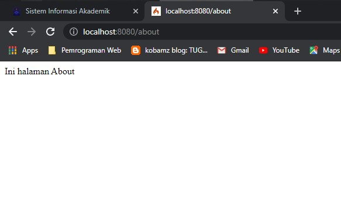
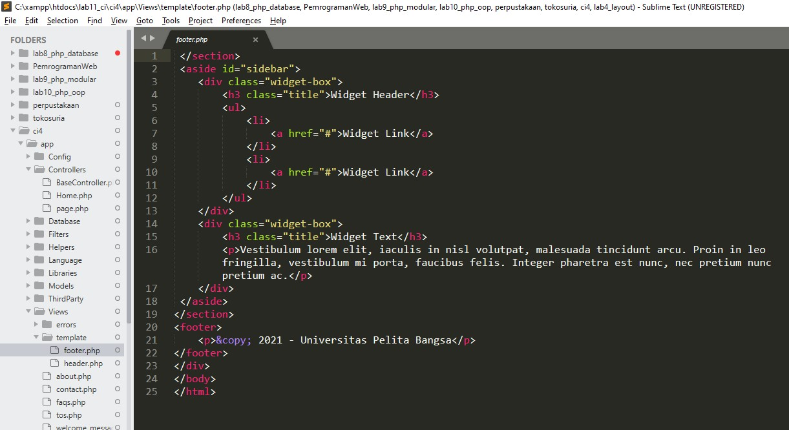
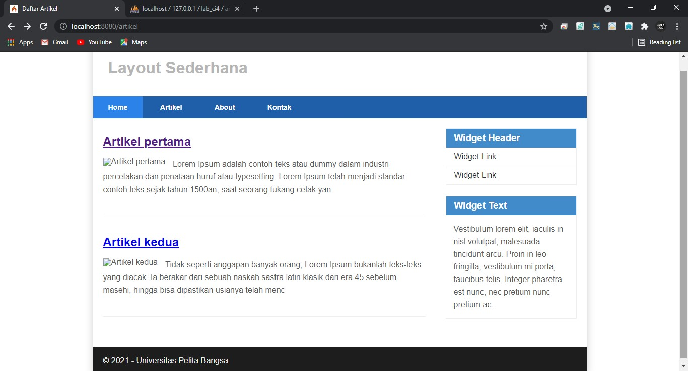
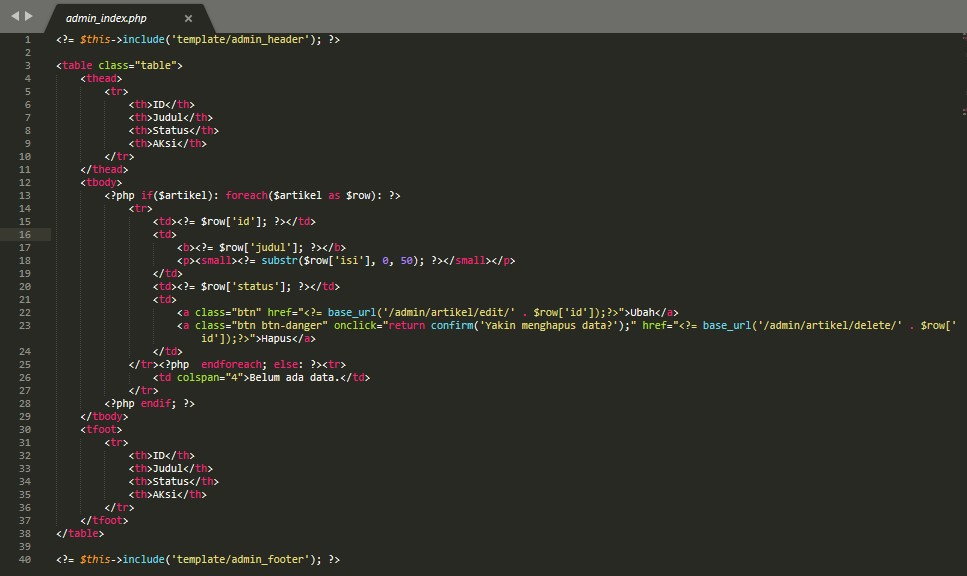

# Pratikum 11,12,13: PHP Framework (Codeigniter)
<h2> PERSIAPAN </h2>

 1. Gunakan text editor, saya menggunakan sublime. 

 2. Menggunakan Xampp 

 3. Membuat folder baru lab11_php_ci 

 Diperlukan konfigurasi  pada webserver, mengaktifkan ekstensi PHP intl. buka xampp di apache klik konfigurasi dan buka php.ini 

 Untuk mengaktifkan extension nya hapus tanda titik kome (;) 

 langkah selanjutnya unduh codeigniter, extrack filenya dan masukan ke dalam xampp/htdock 

 Bukalah localhost:8080 di browser. 

 Codeigniter 4 menyediakan CLI untuk mempermudah proses development. Untuk mengakses CLI buka terminal/command prompt.  

 dan gunakan "php spark" 

 Codeigniter 4 menyediakan fitur debugging untuk memudahkan developer untuk mengetahui pesan error apabila terjadi kesalahan dalam membuat kode program. 
Secara default fitur ini belum aktif. Ketika terjadi error pada aplikasi akan ditampilkan pesan kesalahan seperti berikut.  

 Semua jenis error akan ditampilkan sama. Untuk memudahkan mengetahui jenis errornya, maka perlu diaktifkan mode debugging dengan mengubah nilai konfigurasi pada environment variable CI_ENVIRINMENT menjadi development. 

 Dan ini hasil errornya 

# PENJELASAN TENTANG DIREKTORI CODEIGNETER
* .github folder ini kita butuhkan untuk konfigurasi repo github, seperti konfigurasi untuk build dengan github action; 
* app folder ini akan berisi kode dari aplikasi yang kita kembangkan; 
* public folder ini berisi file yang bisa diakses oleh publik, seperti file index.php, robots.txt, favicon.ico, ads.txt, dll; 
* tests folder ini berisi kode untuk melakukan testing dengna PHPunit; 
* vendor folder ini berisi library yang dibutuhkan oleh aplikasi, isinya juga termasuk kode core dari system CI. 
* writable folder ini berisi file yang ditulis oleh aplikasi. Nantinya, kita bisa pakai untuk menyimpan file yang di-upload, logs, session, dll. 

<h2> Sedangkan file-file yang berada pada root direktori CI sebagai berikut. </h2> 

* .env adalah file yang berisi variabel environment yang dibutuhkan oleh aplikasi. 
* .gitignore adalah file yang berisi daftar nama file dan folder yang akan diabaikan oleh Git. 
* build adalah script untuk mengubah versi codeigniter yang digunakan. Ada versi release (stabil) dan development (labil). 
* composer.json adalah file JSON yang berisi informasi tentang proyek dan daftar library yang dibutuhkannya. File ini digunakan oleh Composer sebagai acuan. 
* composer.lock adalah file yang berisi informasi versi dari libraray yang digunakan aplikasi. 
* license.txt adalah file yang berisi penjelasan tentang lisensi Codeigniter; 
* phpunit.xml.dist adalah file XML yang berisi konfigurasi untuk PHPunit. 
* README.md adalah file keterangan tentang codebase CI. Ini biasanya akan dibutuhkan pada repo github atau gitlab. 
* spark adalah program atau script yang berfungsi untuk menjalankan server, generate kode, dll.

<h2>  Folder app, dimana folder tersebut adalah area kerja kita untuk membuat aplikasi. Dan folder public untuk menyimpan aset web seperti css, gambar, javascript, dll. </h2>

<h2> Pada folder app, dimana folder tersebut adalah area kerja kita untuk membuat aplikasi. Dan folder public untuk menyimpan aset web seperti css, gambar, javascript, dll. </h2>

# Memahami Konsep MVC 

 Codeigniter menggunakan konsep MVC. MVC meripakan singkatan dari Model-View-Controller. MVC merupakan konsep arsitektur yang umum digunakan dalam pengembangan aplikasi. Konsep MVC adalah memisahkan kode program berdasarkan logic proses, data, dan tampilan. Untuk logic proses diletakkan pada direktori Contoller, Objek data diletakkan pada direktori Model, dan desain tampilan diletakkan pada direktori View. 

 Codeigniter menggunakan konsep pemrograman berorientasi objek dalam mengimplementasikan konsep MVC. 

<h2> Model </h2> 

 merupakan kode program yang berisi pemodelan data. Data dapat berupa database ataupun sumber lainnya. 

<h2> View </h2> 

 merupakan kode program yang berisi bagian yang menangani terkait tampilan user interface sebuah aplikasi. didalam aplikasi web biasanya pasti akan berhubungan dengan html dan css. 

<h2> Controller </h2>

 merupakaan kode program yang berkaitan dengan logic proses yang menghubungkan antara view dan model. Controller berfungsi untuk menerima request dan data dari user kemudian diproses dengan menghubungkan bagian model dan view. 

<h2> Routing dan Controller </h2>

 Routing merupakan proses yang mengatur arah atau rute dari request untuk menentukan fungsi/bagian mana yang akan memproses request tersebut. Pada framework CI4, routing bertujuan untuk menentukan Controller mana yang harus merespon sebuah request. Controller adalah class atau script yang bertanggung jawab merespon sebuah request. 
 

<h2> Pada Codeigniter, request yang diterima oleh file index.php akan diarahkan ke Router untuk meudian oleh router tesebut diarahkan ke Controller.  </h2>

<h2> Router terletak pada file app/config/Routes.php </h2>

 Membuat Route 

 Memeriksa penambahan route di CLI dengan perintah "php spark routes"

  

 Mengakses file about.php akan terlihat seperti berikut , karena tidak ada isinya. 

 Membuat controller dengan nama file page.php 

 Hasil yang di tampilkan sebagai berikut 

 Membuat method baru controoller page 

 Ini hasilnya. 

 Membuat view about.php app/view/about.php 

 Mengubah method about pada class Controller Page menjadi seperti ini 

 Ini hasilnya. 

 Membuat CSS pada pratikum ke 4

 Membuat file Header dengan Folder template/view/header.php 

 Membuat file footernya juga 

 Dan kemudian mengubah file about.php pada app/view/about.php 

 Ini hasilnya 

# Pertanyaan dan Tugas 

 Lengkapi kode program untuk menu lainnya yang ada pada Controller Page, sehingga semua link pada navigasi header dapat menampilkan tampilan dengan layout yang sama. 

 Membuat file contact.php, faqs.php, tos.php seperti berikut. 

 membuat sourch code seperti berikut pada file app/Controllers  

 Ini hasilnya 

# Pratikum ke 12

 Membuat table dan database.
  

 Konfigurasi dengan database server dengan mensetting file app/config/database.php 

 Membuat model untuk mengakses artikel. 

 Membuat controller artikel.php 

 Membuat folder baru di dalam app/views dan membuat file baru dengan nama index.php. 

 Hasil Outputnya 

 Menambahkan data ke dalam tabel artikel. 

 Hasil outputnya. 

 Membuat tampilan detail artikel dengan menambahkan fungsi baru pada controller/Artikel.php 

 Membuat view detail.php di direktori app/views/artikel/detail.php 

 Membuat routing untuk artikel detail di app/config/Routes.php 

 Membuat menu untuk proses CRUD dan membuat method baru pada controllers/Artikel.php 

 Membuat views/artikel/admin_index.php untuk tampilan admin. 

 Menambahkan routing pada menu admin. berada di file app/Config/Routes. 

 Hasil outputnya. 

 CRUD Menambah data pada artikel, di direktori app/Controllers/Artikel.php 

 Membuat form tambah di direktori app/views/artikel/form_add.php 

 Hasil Outputnya. 

 Menambahkan fungsi method untuk ubah data artikel di direktori app/Controller/Artikel.php 

 Membuat form ubah yang sudah terisi data sebelumnya. 

 Hasil outputnya. 

 Membuat penghapusan data, dengan menambahkan fungsi/method pada direktori app/Controllers/Artikel.php 

# Pratikum 13

 Membuat table user 

 Membuat model user app/Models/UserModel.php 

 Membuat controller user app/Controllers User.php 

 Membuat view login app/views/login.php 

 Membuat database seeder app/Database/Seeds/UserSeeder.php 

 Output Loginnya 

 Menambahkan Auth Filter app/Filters/Auth.php 

 Tambahkan config auth app/Config/Filters.php 

 Ubah routes app/Config/Routes.php 

 Percobaan output login h.ttp://localhost:8080/admin/artikel dan akan muncul halaman login 

 Fungsi logout 

# Lab11Web
